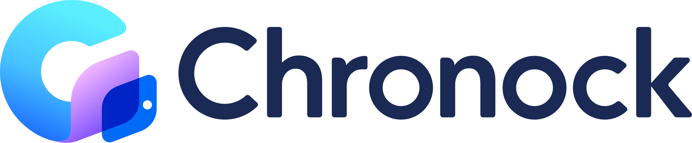

  <a href="https://www.chronock.ai/">
    <picture>
      <source media="(prefers-color-scheme: dark)" srcset="assets/chronock-logo-dark.svg">
      
    </picture>
  </a>

# Chronock for macOS

**Your calendars and scheduling, all in one place.**

Chronock is a unified calendar app with scheduling links and automatic event copying.

- **Bring your calendars together.** Manage Google Calendar and Microsoft Outlook calendars in one place.
- **Share a link to find a time.** Let guests book from your available times.
- **Copy events automatically.** Keep time blocked across your work and personal calendars.

For features, supported integrations, and pricing, visit **[chronock.ai](https://www.chronock.ai/)**.

## Download

**[Download Chronock for macOS](https://github.com/pluralworks/chronock-desktop/releases/latest/download/macos-arm64-Chronock.dmg)** · [All releases](https://github.com/pluralworks/chronock-desktop/releases)

Requires **Apple Silicon and macOS 14 or later**. The app is signed with Developer ID and notarized by Apple.

1. Download and open the DMG.
2. Drag **Chronock** into **Applications**.
3. Launch Chronock and sign in through your browser.

To update, quit Chronock and replace it with the app from the latest DMG. Automatic updates are not available yet.

## On your desktop

Keep Chronock in its own app window and view previously loaded calendar data offline with an encrypted local cache. Initial sign-in, synchronization, and editing require an internet connection.

This repository hosts the official macOS releases and their checksums. For product details and support, visit the [website](https://www.chronock.ai/) or [contact us](https://www.chronock.ai/contact).
